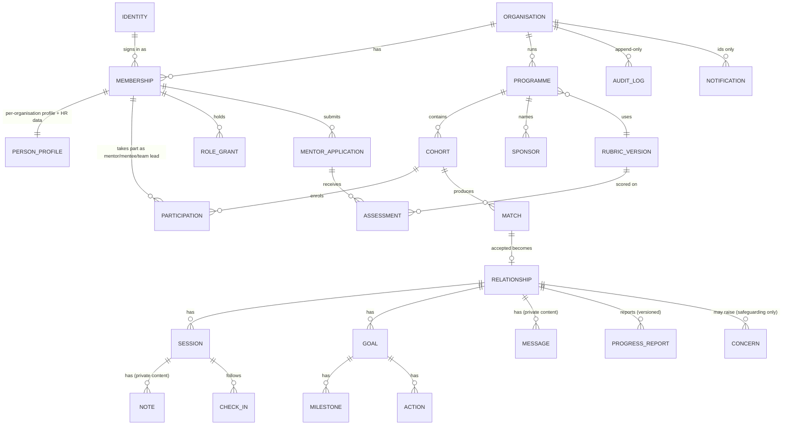

# Domain model

**Applies to:** FR-TEN-002, FR-PRG-001, FR-REL-005, FR-HLT-005/006, FR-RPT-002 · Plan §6 · INV-1, INV-2, INV-7
This document describes entities, relationships, **states and their transitions**, and the **relationship-health rules**. It is the conceptual model; the physical schema is derived from it in S1+ (plain SQL migrations).

Constants are referenced as `C-nnn` ([constants.md](01-prd/constants.md)). Glossary terms: [02-glossary.md](02-glossary.md).

---

## 1. Structure overview

**Identity and per-organisation data.** One **identity** (email, TOTP seed encrypted, locale) is global. Everything about a person *in an organisation* — profile, HR data (employee id, department, grade, manager), participations, roles — hangs off a **membership** and carries that organisation's `organisation_id`. A second organisation later means a second membership row, not a schema change (FR-TEN-002).

## 2. Entities

`org_id` = carries `organisation_id` with forced RLS (INV-1). **PC** = private content (INV-2). **TS** = timestamps/status readable by restricted jobs and dashboards (INV-2.4).

### 2.1 Organisation, identity, access

| Entity | Key fields | Notes |
|---|---|---|
| organisation (global) | id, name, slug, locales, default locale, time zone, `residency_signoff_at`, `ai_enabled`, email domains | Global table; allowlisted |
| identity (global) | id, email (unique, lower-case), `totp_secret_enc`, locale | No password column (INV-8.4) |
| membership (org_id) | id, identity_id, status (`active` · `inactive` · `invited`), source (`import` · `invite`) | Sign-in allowed only if `active` (FR-TEN-005) |
| person_profile (org_id) | membership_id, display name, department, job title, languages[], interests[], bio, visibility settings | Per-field visibility (§5 of permission matrix) |
| hr_record (org_id) | membership_id, employee_id, hire_date, grade_id, manager_membership_id, status | **Grade bucket and reporting line**: engine inputs, never displayed |
| grade_ladder (org_id) | id, name, order_index, bucket | Raw grade numbers never shown (FR-IMP-006) |
| role_grant (org_id) | membership_id, role (`pm` · `assessor` · `content_manager` · `safeguarding` · `org_admin`), scope_type (`org` · `programme` · `cohort`), scope_id | Participation is **not** a role |
| login_attempt / token (org_id nullable) | id, identity ref, token hash, browser binding hash, expires_at, used_at, attempts | Single use (INV-5.4) |
| session_web (identity) | id, identity_id, issued_at, last_seen_at | Application sessions |

### 2.2 Programmes

| Entity | Key fields |
|---|---|
| programme (org_id) | id, type (`leadership` · `sparklab` · `open`), name, status (`draft` · `active` · `closed`), cadence_days, weights (7 ints total 100), exclusion switches, report schedule, ai_enabled, capacity default, rubric_version_id |
| cohort (org_id) | id, programme_id, name, start_date, end_date, status |
| eligibility_rule (org_id) | programme_id, rule type, parameters (tenure, grade bucket, department…) |
| participation (org_id) | id, cohort_id, membership_id, kind (`mentor` · `mentee` · `team_member`), is_team_lead, status (`invited` · `enrolled` · `withdrawn`), capacity (mentors) |
| team (org_id) | id, cohort_id, name, needed_expertise tags[], current_phase (`develop` · `design` · `test`), lead participation |
| sponsor (org_id) | programme_id, name, email, role label |
| compatibility_question / answer (org_id) | programme_id, section (`character` · `field` · `experience`), mode (`similar` · `complementary`), scale |
| settings_version (org_id) | id, scope (`programme` · `organisation`), scope_id, group (`matching` · `exclusions` · `cadence_capacity` · `timings` · `security`), version number, validated values, created_by, created_at, restored_from_version_id — **immutable**; no free text |

### 2.3 Matching inputs

| Entity | Key fields |
|---|---|
| taxonomy_topic | id, parent_id, translations (en/az/ru), synonyms[] — org-level overrides allowed |
| person_topic (org_id) | membership_id, topic_id, role (`offers` · `seeks`), depth (`working` · `advanced` · `expert` for offers) |
| mentor_phase_experience | mentor, phase |
| availability_rule (mentor) / availability_window (mentee) (org_id) | weekday, start, end, time zone, valid from/to |
| interest_tag | curated |
| language_proficiency | membership_id, language, level (`working` · `fluent`) |
| block (org_id) | blocker, blocked |

### 2.4 Vetting

| Entity | Key fields |
|---|---|
| rubric_version (org_id or global-seeded) | id, name, version, items (sections → items with max score), bands (score ranges → advisory outcome), `immutable_since` |
| mentor_application (org_id) | id, programme_id, membership_id, status, source (`applied` · `nominated`), submitted_at, decision, decision_reason_differs_flag |
| assessment (org_id) | id, application_id, assessor_membership_id, item scores, submitted_at, conflict_check result |
| decision_release | application_id, released_feedback (PM-authored), released_at |

### 2.5 Matches and relationships

| Entity | Key fields |
|---|---|
| match (org_id) | id, cohort_id, mentor_participation_id, mentee_participation_id **or** team_id, mode (`requested` · `proposed` · `draft`), status, `engine_version`, `matching_settings_version_id`, `snapshot_hash`, `explanation` (reason codes + sub-scores), created_by, expires_at |
| match_party_answer | match_id, party (mentor · mentee · team_lead), answer (`pending` · `accepted` · `declined`), answered_at, **private_reason** (PM-only, PC-like) |
| exclusion_override (org_id) | match or pair ref, exclusion code, reason (PM-visible), by, at |
| relationship (org_id) | id, match_id, cohort_id, status, started_at, ended_at, ended_by_kind, previous_relationship_id |
| relationship_member | relationship_id, participation_id, role (`mentor` · `mentee` · `team_member` · `team_lead`) |

### 2.6 Shared workspace

| Entity | Key fields | Class |
|---|---|---|
| session (org_id) | id, relationship_id, start, end, status, ics_uid, ics_sequence, location/Teams link | TS |
| session_attendee | session_id, membership_id | TS |
| agenda_item | session_id, text | PC |
| note | session_id, author, text, `is_private` | **PC** |
| decision, reflection | session_id/relationship_id, author, text | **PC** |
| goal (org_id) | id, relationship_id, title, status, is_primary, tags[], visibility, smart fields (Leadership), carried_from_goal_id | goal text is member-visible; PM sees tags/status only |
| milestone | goal_id, title, due, status | |
| action | goal_id/session_id, owner, due, status, difficulty (1–5, Leadership) | |
| message | relationship_id, author, text, sent_at | **PC** |
| check_in | session_id, author, answers (3), `support_requested`, submitted_at | answers private to author; flag/ts visible to PM |
| progress_report | relationship_id, period, status, current_version | structured; see §7 |
| progress_report_version | report_id, version, content fields, submitted_at | immutable per version |
| concern (org_id) | id, relationship_id, reporter, text, routed_to, status | readable only by safeguarding |
| activity_ts (org_id) | relationship_id, last_session_at, last_message_at, last_note_at | **TS**: the only thing health rules and dashboards read about activity |

### 2.7 Platform

| Entity | Key fields |
|---|---|
| notification | id, recipient, template_code, subject_type, subject_id, created_at, read_at — **no text** |
| consent / consent_version | person, version, accepted_at, scope (privacy notice, AI, programme data sharing) |
| data_subject_request | person, type (`export` · `erasure`), status, handled_by, dates |
| audit_log (append-only) | id, org_id, actor, action code, object type, object id, status, created_at — **no free text** |
| import_run / import_row | run id, counts, raw rows (30 days, C-104) |
| job (worker queue) | graphile-worker tables; `job_run` summary: id, queue, status, attempts, error code, times — retained C-162, no payloads shown |
| delivery_attempt | notification_id, status (`queued` · `sent` · `deferred` · `bounced` · `failed`), error code, attempted_at — **no recipient content, no message body**; retained C-161 |
| feature flags | stored as a `settings_version` group `flags` per organisation or programme, with prerequisites (recorded approvals) enforced on save |
| settings_template (org_id) | id, name, programme type, referenced settings versions, rubric_version_id, report schedule — no people data |
| approval_request (org_id) | id, action code (`residency_signoff` · `safeguarding_contact_change` · `grant_org_admin` · `bulk_erasure`), subject ids, requested_by, decided_by, status, expires_at (C-160), decided_at — no free text |
| announcement (org_id) | id, scope (organisation / programme), text (≤ C-164, admin-authored, no personal data), starts_at, ends_at, created_by |
| scheduled_export (org_id) | id, programme_id, report code, frequency (C-168), recipients (membership ids), next_run_at, last_run_at, status — aggregates only |

## 3. Roles and scopes (summary)

Roles: **programme manager, assessor, content manager, safeguarding, org admin** — each scoped to an organisation, a programme or a cohort (FR-TEN-010). **Platform admin** is global and has no tenant content access. **Mentor / mentee / team lead** are participations. Full rules: [permission matrix](04-permission-matrix.md).

## 4. State machines

Conventions: *Actor* is who can trigger; *Guard* is a condition that must hold; *Effects* are side effects (audit, notifications from the [catalogue](01-prd/notification-catalogue.md)). Every transition writes an audit entry (ids + statuses only). Any transition not in a table is **illegal** and rejected by the database (check constraint / trigger) as well as by the service.

### 4.1 Mentor application

States: `draft` · `nominated` · `submitted` · `in review` · `approved` · `rejected` · `withdrawn` · `suspended`.

| From | Event | To | Actor | Guard | Effects |
|---|---|---|---|---|---|
| — | PM nominates | nominated | PM | person is active participant; not already approved | N-020 |
| — | Person starts application | draft | Applicant | programme accepting applications | — |
| nominated | Nominee accepts nomination | draft | Nominee | — | — |
| nominated | Nominee declines | withdrawn | Nominee | — | — |
| draft | Submit | submitted | Applicant | form complete | N-021 |
| submitted | Assessor assigned | in review | PM | assessor passes conflict check (self, direct manager, direct report blocked); ≤ 2 assessors (C-026) | N-022 |
| in review | All assessors submitted | in review | system | — | N-024 (decision ready) |
| in review | Decision: approve | approved | PM | all assessments in; reason required if differs from advisory band | N-025; mentor becomes discoverable once min profile met |
| in review | Decision: reject | rejected | PM | same | N-025 |
| submitted | Approve without assessment | approved | PM | **Open programme only** (recorded exception to D9) | N-025 |
| draft / submitted / in review | Withdraw | withdrawn | Applicant | — | — |
| approved | Suspend | suspended | PM | reason recorded (audit: code only) | Mentor leaves discovery/matching immediately; existing relationships flagged to PM (FR-VET-011) |
| suspended | Reinstate | approved | PM | — | — |
| rejected, withdrawn | Re-apply | draft (new application) | Applicant | after the cool-off C-151 | — |

Terminal in the sense of a single application: `rejected`, `withdrawn`. `approved ↔ suspended` is reversible.

### 4.2 Match

States: **initial** `draft` (admin draft), `proposed` (published admin match), `requested` (Open request); **terminal** `accepted` · `declined` · `withdrawn` · `expired` · `discarded`.

| From | Event | To | Actor | Guard | Effects |
|---|---|---|---|---|---|
| — | Generate draft | draft | PM | cohort active | — |
| draft | Discard | discarded | PM | — | — |
| draft | Publish | proposed | PM | **every pair re-checked** (exclusions, capacity); `expires_at = now + C-001` | N-035 to each required party |
| proposed | A required party accepts | proposed | party | — | `match_party_answer` updated; N-037 to the other |
| proposed | All required parties accepted | **accepted** | system | **capacity re-checked atomically** (INV-7.8) | N-038; relationship created |
| proposed | Any required party declines | declined | party | private reason captured (PM only) | N-039 to PM; decline blocks the pair for C-004 |
| proposed | PM withdraws | withdrawn | PM | — | neutral notice |
| proposed | Window passes | expired | system | `now > expires_at` | N-039 to PM |
| — | Mentee requests | requested | Mentee | ≤ C-023 open requests; pair not excluded | N-030; `expires_at = now + C-002` |
| requested | Mentor accepts | accepted | Mentor | capacity re-checked atomically | N-033, relationship created |
| requested | Mentor declines | declined | Mentor | — | N-034 (neutral) |
| requested | Mentee withdraws | withdrawn | Mentee | — | — |
| requested | Window passes | expired | system | after reminder at C-003 | N-032 |

**Required parties.** Leadership: mentor **and** mentee (D13). SparkLab: mentor **and** team lead; other members are notified, not asked (D13). Open: mentor only.

### 4.3 Relationship

States: `active` · `paused` · `completed` · `closed`.

| From | Event | To | Actor | Guard | Effects |
|---|---|---|---|---|---|
| — | Match accepted | active | system | — | workspace created |
| active | Pause | paused | any member | immediate, no approval (FR-REL-006) | N-040, N-041 |
| paused | Resume | active | any member | — | — |
| active / paused | Leave (individual) | closed* | member | *1:1:* closes; *team:* a team member leaving leaves the team, relationship stays `active` if mentor and team lead remain **[PROPOSED]** (OQ-B1-21) | N-040, N-041 |
| active | Complete | completed | PM | Leadership: ≥ C-013 elapsed (or PM reason) and final report submitted or waived | — |
| active / paused | Rematch | closed (reason `rematch`) | PM or mentee/team lead | reason required | N-042; new match drafted; goals carried only if ticked |
| active / paused | PM closes | closed | PM | reason recorded (code) | N-040 |

`completed` = ran its course. `closed` = ended early (leave, rematch, PM). Both are terminal; content retention starts at `ended_at` (C-100).

### 4.4 Session

States: `scheduled` · `completed` · `cancelled` · `no-show`.

| From | Event | To | Actor | Guard | Effects |
|---|---|---|---|---|---|
| — | Book | scheduled | any member | slot free for all attendees (DB exclusion constraint); team quorum (C-027) | N-050 (.ics REQUEST) |
| scheduled | Reschedule | scheduled | any member | new slot free | N-051 (.ics SEQUENCE+1) |
| scheduled | Cancel | cancelled | any member | — | N-052 (.ics CANCEL); counts toward A4 |
| scheduled | Mark completed | completed | mentor or mentee/team lead | session start has passed | N-060; updates activity timestamp |
| scheduled | Mark no-show | no-show | the other party | start + C-158 passed | counts toward A4 |
| completed | Undo | scheduled | marker | within 24 h, nothing recorded **[PROPOSED]** | — |

### 4.5 Goal

States: `draft` · `active` · `achieved` · `dropped`.

| From | Event | To | Actor | Guard |
|---|---|---|---|---|
| — | Create | draft | mentee (team lead) | — |
| draft | Activate | active | mentee | Leadership: SMART fields complete |
| draft / active | Drop | dropped | mentee (mentor can propose) | — |
| active | Achieve | achieved | mentee, confirmed by mentor (Leadership) | — |
| achieved / dropped | Reopen | active | mentee | within the relationship, not after close |

### 4.6 Progress report

States: `due` → `submitted` (one amendment allowed, C-031) · `waived`.

| From | Event | To | Actor | Guard | Effects |
|---|---|---|---|---|---|
| — | Period ends / schedule | due | system | mandatory programme (D14) or PM-enabled in Open | N-070 |
| due | Submit | submitted (v1) | mentor | required fields complete | N-072 |
| submitted (v1) | Amend | submitted (v2) | mentor | only once; shows "amended" | N-073 |
| due | Waive | waived | PM | reason recorded | N-074 |
| due | Overdue | due (flag A5) | system | > C-009 days past due date | N-071 |

### 4.7 Other small lifecycles

| Object | States |
|---|---|
| Concern | `received` → `acknowledged` → `in progress` → `closed` (safeguarding only) |
| Import run | `previewed` → `confirmed` → `processed` · `failed` · `abandoned` |
| Data-subject request | `received` → `in progress` → `done` · `refused` (with reason code) |
| Participation | `invited` → `enrolled` → `withdrawn` |
| Approval request | `pending` → `approved` (action executes) · `rejected` · `expired` (C-160) · `withdrawn`; the requester can never approve their own request; blocked while fewer than C-163 org admins exist |

## 5. Matching inputs recap

Taxonomy (EN/AZ/RU + synonyms), expertise depth, language proficiency, mentor availability rules and mentee windows, grade ladder and manager chain from the HR import, and for SparkLab the team's needed expertise and phase. Details: [matching-spec](01-prd/matching-spec.md).

## 6. Relationship health

Health is computed by a background job from **activity timestamps and statuses only** (INV-2.4). Thresholds are **relative to each programme's cadence** (C-020 for the PROPOSED defaults).

### 6.1 Rules

| Code | Rule | Condition | Constants | Applies when |
|---|---|---|---|---|
| **I1** | No recent session | `now − last_completed_session_at > 2 × cadence` (and at least one completed session exists) | C-014, C-020 | relationship `active` |
| **I2** | Accepted, never met | `now − accepted_at > 21 days` and no session `completed` | C-005 | `active` |
| **A2** | Support requested | open check-in flag "I'd like support" not yet acknowledged by PM | — | any state except `closed` |
| **A4** | Repeated cancellations / no-shows | ≥ 2 sessions `cancelled` or `no-show` in the last 60 days | C-007, C-008 | `active` |
| **A5** | Report overdue | a mandatory report is `due` and `now − due_date > 7 days` | C-009 | `active` |

Notes:

- `I` = *inactivity*, `A` = *attention*. The Plan lists only I1, I2, A2, A4, A5; numbers I3, A1, A3 are **not allocated** and are reserved. Do not reuse them for new rules without a decision-log entry (OQ-B1-12).
- A `paused` relationship raises no I-rules (except A2).
- A flag clears automatically when its condition stops being true; A2 clears when the PM acknowledges.
- Health is **recomputed**, not edited. The PM sees which codes fired and the timestamp involved, never content.

### 6.2 Health states for display

A relationship shows `On track` (no flags), `Needs attention` (≥ 1 flag), or `Support requested` (A2). Status is also conveyed by icon and text, never by colour alone (NFR-A11Y-001).

### 6.3 "Where should I intervene?" — PM action list

One list, strictly in this priority order (Plan §6); within each tier, oldest item first **[PROPOSED]** (OQ-B1-13):

| Priority | Item | Source |
|---|---|---|
| 1 | Support requests | A2 |
| 2 | Inactive relationships | I1 |
| 3 | Matches with no first session after **14 days** | C-006 |
| 4 | Unanswered proposals or requests | match `proposed`/`requested` pending past half the window **[PROPOSED]** |
| 5 | Mentors over capacity | `load > capacity` (arises only if capacity is later reduced; INV-7.8 prevents exceeding it on accept) |
| 6 | Overdue reports | A5 |

> Open point: the intervene list flags "no first session" at 14 days, whereas rule **I2** fires at 21 days. These are intentionally different — the list is an early nudge, the flag is a health state — but this is recorded as OQ-B1-11 for confirmation.

## 7. Progress report content (structured)

A report is **structured with bounded free text**. It must not copy or quote notes, reflections or messages (INV-2.5). Fields **[PROPOSED]**, to be fixed in Batch 3:

| Field | Type |
|---|---|
| period (start/end) | dates, set by schedule |
| sessions held / planned | integers (system-filled from timestamps) |
| progress per goal | per goal: status + progress level (1–5) |
| topics covered | taxonomy tags |
| engagement level | scale 1–5 |
| challenges / risks | checklist + short text (≤ 1,000 characters) |
| support needed from programme | checkbox + short text |
| next-period focus | goal references + short text |
| overall assessment (final report) | scale + short text |
| recommendation (final report) | continue / adjust / conclude |

Visibility: PM, mentee (of that relationship), author. Not org admins (unless also PM on that programme), not line managers. The **sponsor pack** (final-evaluation pack) is composed from the final report and programme-level result fields — never from session notes, reflections or messages — and every export is logged with recipients (D15).

## 8. Home: "What should I do next?"

Evaluated per user in this fixed order. The first match is the **main card**; up to **two more** matches become "also due" items (C-029). If nothing matches the user sees "You're up to date".

| # | Card | Condition |
|---|---|---|
| 1 | A session about to start | session starts within C-159 or has started |
| 2 | A proposal or request waiting on me | match pending with my answer outstanding |
| 3 | Prepare for a session within 24 hours | next session starts < C-011 |
| 4 | Wrap up a finished session | session ended, not marked completed or no wrap-up |
| 5 | Check-in due | completed session without my check-in |
| 6 | Report due | report `due` and I am the author |
| 7 | Assessment assigned | assessment pending for me |
| 8 | Overdue action | an action I own is past due |
| 9 | Missing goal | active relationship, I am a mentee, no goal |
| 10 | Book the first session | active relationship, no session scheduled |
| 11 | Set availability | no availability recorded |
| 12 | Set a goal | no goal (Open programme, optional) |
| 13 | See suggestions | Open programme, no open request, recommendations exist |
| 14 | Waiting on a request | I have an open request |
| 15 | Finish my profile | profile below minimum |
| 16 | Mentor applications open | programme accepts applications and I am eligible |
| 17 | You're up to date | none of the above |

The rule set is a pure function (unit-tested table); the same state always yields the same card.

## 9. Database-level guarantees (summary)

| Guarantee | Mechanism |
|---|---|
| No cross-organisation reads/writes | RLS on `organisation_id` (INV-1) |
| No admin read of private content | RLS on membership/author (INV-2) |
| No double-booking | exclusion constraint on (attendee, `tstzrange(start,end)`) over active sessions |
| Capacity never exceeded | atomic accept: row lock on the mentor's capacity row, count active relationships/teams, then insert |
| One active relationship per mentee per programme | partial unique index |
| ≤ 2 open Open-requests per mentee | constraint trigger |
| Immutable rubric once used | trigger rejecting update after first assessment |
| Immutable settings versions | no update/delete grant on `settings_version`; trigger |
| Append-only audit log | no `UPDATE`/`DELETE` grant; trigger |
| Notification has no text | no text column |
| Legal state transitions only | check constraints/transition table per object (§4) |
| Progress report versions immutable | no update grant on `progress_report_version` |

## 10. Retention

| Data | Kept for | Then | Constant |
|---|---|---|---|
| Relationship content (notes, reflections, messages, agenda, check-in answers) | 12 months after the relationship ends | deleted | C-100 |
| Structured records (matches, goals, sessions, reports, participations) | 36 months | anonymised | C-101 |
| Assessments | 24 months | deleted | C-102 |
| Audit log | 24 months | deleted | C-103 |
| Raw import rows | 30 days | deleted | C-104 |

All pending Legal sign-off. Retention jobs are idempotent, audit-logged by counts, and tested with a time-travel fixture.
